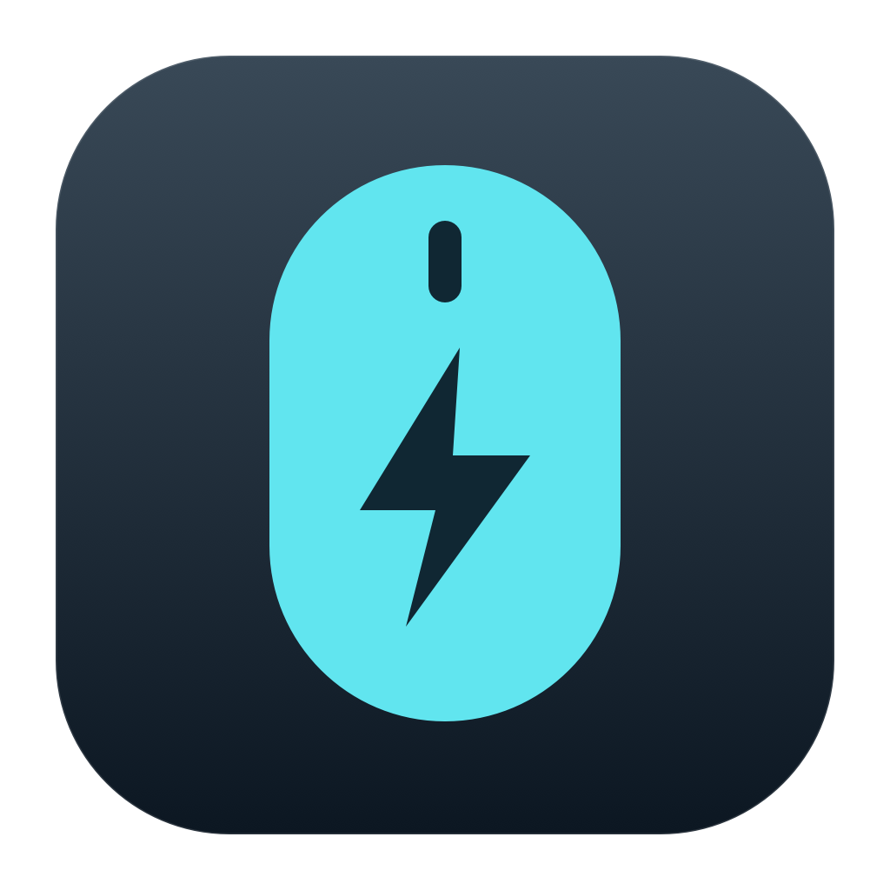
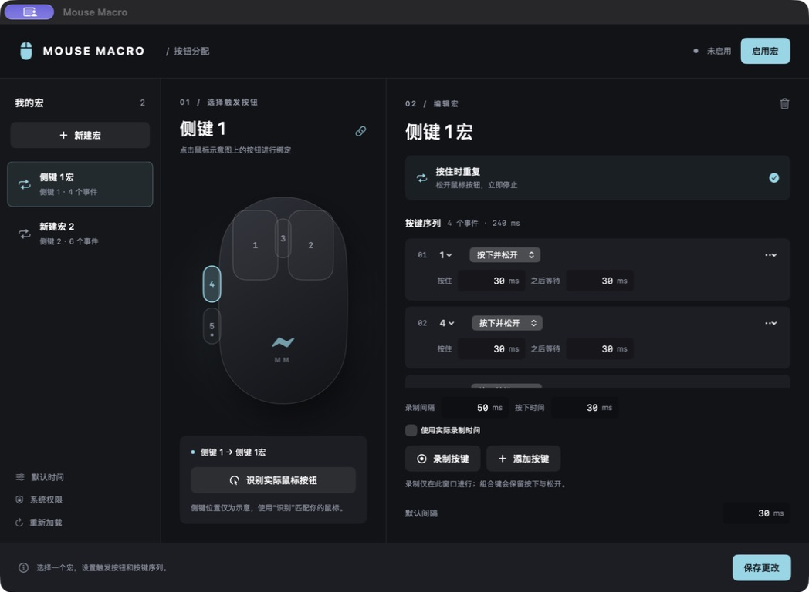
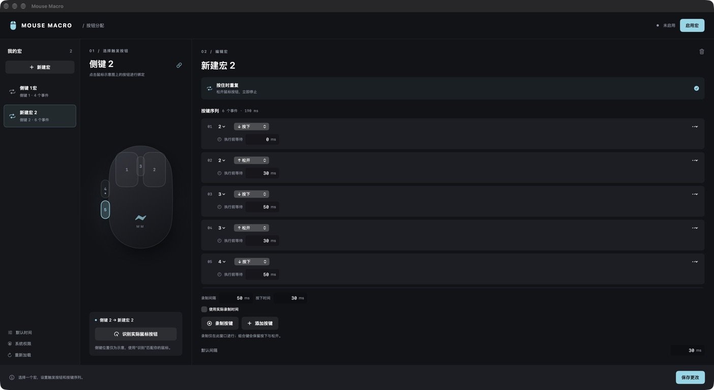

# Mouse Macro



按住鼠标按钮，循环播放键盘宏；松开立即取消并释放宏按键。支持多个鼠标绑定、侧键、独立时间设置，以及 macOS 原生配置和录制窗口。

## 界面预览

原生 SwiftUI + AppKit 三栏工作区：左侧管理宏，中间选择鼠标按钮，右侧编辑按键序列。日常使用无需编辑配置文件。



## macOS 快速开始

### 1. 构建并打开应用

需要 **macOS 12+**、Rust 和 Xcode Command Line Tools。

```sh
git clone https://github.com/huyumars/mac-mouse-macro.git
cd mac-mouse-macro
./scripts/build-macos.sh
open "target/Mouse Macro.app"
```

脚本生成本地签名的 `.app`，可复制到 Applications 后使用。首次构建会下载 Cargo 依赖。建议先确定应用的存放位置，再进行授权；重新编译或移动应用后，系统可能要求重新授权。

### 2. 授予系统权限

点击左下角 **「系统权限」**，分别检查：

| 权限 | 用途 |
| --- | --- |
| 辅助功能 | 发送模拟键盘按键 |
| 输入监控 | 监听全局鼠标按钮 |

点击 **「请求系统授权」** 后，根据 macOS 提示完成授权。若系统没有弹窗，点击对应的 **「打开系统设置」**，在列表中打开 Mouse Macro 的开关。

列表中没有应用时，可点击 **「在 Finder 中显示当前应用」**，再用系统设置中的 **＋** 添加该应用，或把它拖入列表。授权完成后返回应用，点击 **「重新检测」**；必要时完全退出并重新打开应用。


> 两项权限独立生效，仅开启输入监控不能发送模拟按键。若开关已开启但仍检测失败，请确认添加的是当前运行的版本；重新构建后可移除旧条目，再添加当前应用。程序不会替你操作系统授权开关。

### 3. 新建宏并绑定鼠标按钮

1. 点击左侧 **「新建宏」**，在右侧标题处输入名称。
2. 点击鼠标示意图上的左键、右键、中键或侧键，为当前宏选择触发按钮。
3. 不确定侧键编号时，点击 **「识别实际鼠标按钮」**，在窗口空白处按下目标按钮；按 Esc 可取消识别。

一个鼠标按钮只能绑定一个宏。鼠标示意图的侧键位置仅供参考，实际编号以识别结果为准。

### 4. 录制或手动编辑按键

以“依次按下 2、3、4”为例：

1. 保持 **录制间隔 50 ms、按下时间 30 ms**，先松开键盘上的所有按键。
2. 点击 **「录制按键」**，在当前窗口依次按下并松开 `2`、`3`、`4`。
3. 点击 **「结束录制」**。每个按键会形成一条按下和一条松开事件。
4. 检查事件卡片：第一键按下前等待 0 ms，松开前等待 30 ms，下一键按下前等待 50 ms。
5. 点击 **「保存更改」**。



也可点击 **「添加按键」** 手动创建事件。卡片内可选择按键、切换动作、修改时间；右侧省略号菜单支持上移、下移和删除。删除整个宏使用编辑区右上角的垃圾桶按钮。

录制支持组合键与左右修饰键，保留按下 / 松开顺序和重叠关系。新录制会**追加到当前宏末尾**；切换窗口会自动结束录制，尚未松开的键会补上释放事件。只录制此窗口的键盘输入，不录制其他应用输入或鼠标移动，单次最多 10000 个事件。

### 5. 调整时间并启用宏

| 控件 | 作用 |
| --- | --- |
| 录制间隔（默认 50 ms） | 固定时间录制中，前一键释放到下一键按下之间的等待 |
| 按下时间（默认 30 ms） | 固定时间录制中，普通按键保持按下的时长 |
| 使用实际录制时间 | 改为保存真实输入的时间间隔 |
| 事件卡片内的时间 | 单独调整已有事件；修改录制默认值不会改写这些值 |
| 编辑区底部「默认间隔」 | 当前宏未单独设置的按键间隔，以及录制序列结束后的循环间隔 |
| 左下角「默认时间」 | 未被宏或单个按键覆盖的全局默认时间 |

录制间隔与按下时间会记住上次设置。组合键的修饰键保持到相应释放事件，不会被强制提前松开。

点击右上角 **「启用宏」**，应用会保存并启动。切换到目标应用后，**按住已绑定的鼠标按钮循环播放，松开停止**。点击「停止宏」或退出应用也会释放宏按键。

运行期间修改并保存宏后，需要停止并重新启用才会生效。录制开始前会自动停止播放。

### 保存与兼容性

设置保存在 `~/.config/mouse-macro/config.toml`。UI 自动读取旧版单绑定和多绑定配置，保存时统一为多绑定格式，保留全局、当前绑定及单键时间。无需手工迁移。

保存时会检查外部文件修改；有冲突时保留当前编辑并提示重新加载。空宏、重复按钮绑定和未配对的录制事件不能覆盖已保存内容。录制的物理键码受键盘布局影响。

## 命令行

```sh
cargo build --release
cargo run -- --identify                  # 显示鼠标按钮 ID
cargo run                              # 读取默认路径并运行
cargo run -- --config /path/config.toml # 自定义配置路径
cargo run -- --print-config             # 输出配置；不存在时输出默认示例
cargo run -- --check-config < config.toml
```

默认路径为 `~/.config/mouse-macro/config.toml`。文件不存在时 CLI 使用内存中的默认配置（Left → a）；UI 保存时才创建文件。读取或解析失败会报错，不会覆盖原配置或悄悄启用默认宏。`Ctrl+C` / `SIGTERM` 在 macOS/Linux 会先释放宏按键再退出。`--controlled` 供 UI 使用：标准输入收到数据或 EOF 时退出。

Linux / Windows 保留 `rdev` 后端；Linux 需要 X11 和相关开发库。此次改动在 macOS 编译测试，未在 Linux / Windows 实机验证。录制生成的 `keycode:N` 仅适用于 macOS。

## 配置

```toml
interval_ms = 100
press_duration_ms = 30

[[bindings]]
mouse_button = "4"
interval_ms = 80
keys = ["a", { key = "b", press_ms = 50, delay_ms = 150 }]

[[bindings]]
mouse_button = "Right"
keys = ["1", "2", "kp3"]
```

时间优先级：单个按键 > 当前绑定 > 全局默认值。`press_ms` 为按住时间；`delay_ms` 为释放后到下一按键的间隔。单位毫秒，范围 0–600000；全零配置仍会在每轮之间让出调度，避免空转。

鼠标名称支持 `Left` / `Right` / `Middle`（不区分大小写），数字 `0` / `1` / `2` 对应这三个按钮，其余数字为侧键 ID。不要猜测侧键编号，使用 `--identify` 查看。重复绑定同一按钮、未知按键、空按键列表和无效录制会被拒绝。

旧版顶层 `mouse_button` / `keys` 仍然兼容，也可以与不同按钮的 `[[bindings]]` 共存。仅写 `keys` 时默认绑定 Left。

常用按键：字母、数字、`enter`、`space`、方向键、`tab`、`esc`、`backspace`、`delete`、`home`、`end`、`pageup`、`pagedown`、`f1`–`f12`、`ctrl`、`shift`、`alt`、`cmd`、`rctrl`、`rshift`、`rcmd`、`altgr`、`kp0`–`kp9`、`kpenter` 和常见符号。简单序列逐个按下并释放；组合键使用录制事件格式：

```toml
[[bindings]]
mouse_button = "Middle"
keys = [
  { key = "cmd", action = "down", wait_ms = 0 },
  { key = "a", action = "down", wait_ms = 10 },
  { key = "a", action = "up", wait_ms = 40 },
  { key = "cmd", action = "up", wait_ms = 0 },
]
```

`wait_ms` 是本事件执行前的等待时间；录制序列结束后使用绑定的 `interval_ms` 作为循环间隔。每次按下必须有对应松开。

多个绑定共享同一按键时，调度器在最后一个绑定松开该键后才发送释放，避免相互打断。

## 结构与验证

- `src/config.rs`：兼容旧配置、严格校验和时间解析。
- `src/engine.rs`：单线程调度、取消播放、共享按键状态。
- `src/keys.rs`：按键名称和别名。
- `src/platform.rs`：macOS 事件监听、键码、组合键状态，以及其他平台后端。
- `macos/MouseMacro.swift`：原生窗口和应用生命周期。
- `macos/MacroViews.swift`：宏列表、鼠标绑定示意和事件编辑器。
- `macos/MacroModel.swift`：数据模型、窗口内录制、原子保存和播放控制。
- `macos/KeyNames.swift`：按键菜单和显示名称。

```sh
cargo fmt --check
cargo test --offline
cargo clippy --offline --all-targets -- -D warnings
./scripts/build-macos.sh
./scripts/test-macos.sh
```

回归测试覆盖旧配置、时间覆盖、无效配置不覆盖文件、录制事件配对、快速释放 / 重按、并发绑定共享按键和 macOS 键码映射。

已验证 macOS 界面、宏增删、中文命名、按钮绑定、保存重载、普通键与 Shift 组合键录制、固定录制时间（50/30 ms 及自定义 80/45 ms）、系统权限检测与宏启用。真实目标应用中的持续回放和松开停止，仍需结合实际鼠标验收；Linux / Windows 尚未实机验证。

界面交互参考：[Logitech Gaming Software 官方手册](https://www.logitech.com/assets/51813/3/lgs-guide.pdf)中的按钮分配、按键事件编辑与按住重复模式。项目仅实现现有的按住重复模式，未添加无效的切换 / 单次播放选项。
